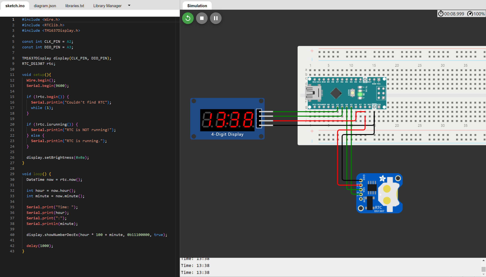

### Отчет по проектной практике 
### "Разработка приложения для Arduino: часы реального времени"

## Введение ##
Цель проекта состояла в разработке часов реального времени на платформе Arduino, используя модули TM1637 для отображения времени и DS1302 для хранения и отслеживания времени.

## Используемые компоненты
1. Модуль TM1637 - используется для отображения времени.
2. Модуль DS1302 - предоставляет возможность отслеживания и хранения времени.
3. Плата Arduino Nano - используется как контроллер.

## Описание работы приложения
### Код программы для Arduino
```c
#include <TM1637Display.h>
#include <DS1302.h>


const int CLK_PIN = A2;
const int DIO_PIN = A3;
TM1637Display display(CLK_PIN, DIO_PIN);
DS1302 rtc(4, 5, 6);


void setup() {
  Serial.begin(9600);
  rtc.begin();


  if (rtc.chipPresent()) {
    Serial.println("DS1302 is present!");
  } else {
    Serial.println("Couldn't find DS1302");
    while (1);
  }


  if (rtc.haltFlag()) {
    rtc.clearHaltFlag();
    Serial.println("DS1302 was halted, cleared halt flag");
  }


  rtc.writeProtect(false); // Отключение защиты записи
  display.setBrightness(0x0a);
}


void loop() {
  Time t = rtc.time();
  int hour = t.hr;
  int minute = t.min;
  Serial.print("Time: ");
  Serial.print(hour);
  Serial.print(":");
  Serial.println(minute);
  display.showNumberDec(hour * 100 + minute, true);
  delay(1000);
}

```
# Описание работы кода
1. В функции setup происходит инициализация модуля DS1302 и установка начального времени.
2. В функции loop происходит постоянное считывание текущего времени с модуля DS1302 и отображение его на модуле TM1637 с задержкой в 1 секунду.

## Схема сборки 

## Фотография работающего проекта

## Полученные навыки
1. Понимание работы с микроконтроллером Arduino: Разработка позволила изучить использование платформы Arduino для управления модулями.
2. Использование внешних модулей: Работа с внешними модулями вроде DS1302 и TM1637, которая позволила ознакомиться с базовыми принципами использования внешних модулей.

## Заключение
В данном отчете представлена информация о проектировании часов реального времени на платформе Arduino с использованием модулей TM1637 и DS1302. Описаны компоненты, использованные в проекте, а также представлен код программы и ее работа. Дополнительно в отчете были представлены схема сборки и фотография работающего проекта.


